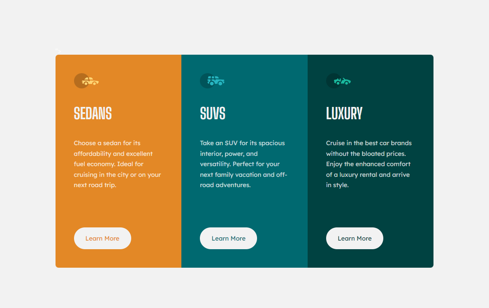

# Frontend Mentor - 3-column preview card component solution

This is a solution to the [3-column preview card component challenge on Frontend Mentor](https://www.frontendmentor.io/challenges/3column-preview-card-component-pH92eAR2-). Frontend Mentor challenges help you improve your coding skills by building realistic projects. 

## Table of contents

- [Overview](#overview)
  - [The challenge](#the-challenge)
  - [Screenshot](#screenshot)
- [My process](#my-process)
  - [Built with](#built-with)
  - [What I learned](#what-i-learned)
  - [Continued development](#continued-development)
- [Author](#author)

## Overview

### The challenge

Users should be able to:

- View the optimal layout depending on their device's screen size
- See hover states for interactive elements

### Screenshots

## My process

### Built with

- Semantic HTML5 markup
- CSS custom properties
- Flexbox
- CSS Grid

### What I learned

I used the grid layout in this design which I found slightly easier to use then flex box, although I did use flex for the content inside each section. I really liked using grid-template-areas as I felt that simplied the process so much. Assigning elements an area felt like I had more control over where everything was!

I also feel like I am becoming more confident with my HTML mark up as I a feel able to use appropriate semantic HTML to make the content more accessible. I want to get into good habits from the beginning!

### Continued development

What I struggled with the most was the responsiveness of the design. At one point, when the grid shrank down with the size of the window, the paragraph in one of the articles pushed the button down. This didn't happen in the other two articles as the paragraphs were shorter. I got around it by using media queries as soon as the first shrink appeared, but I am wondering if there is a better method to solve this issue. Any feedback would be greatly welcomed!

## Author

- Frontend Mentor - [@MissEmMcCarthy](https://www.frontendmentor.io/profile/MissEmMcCarthy)
- Twitter - [@MissEmMcCarthy](https://twitter.com/MissEmMcCarthy)

